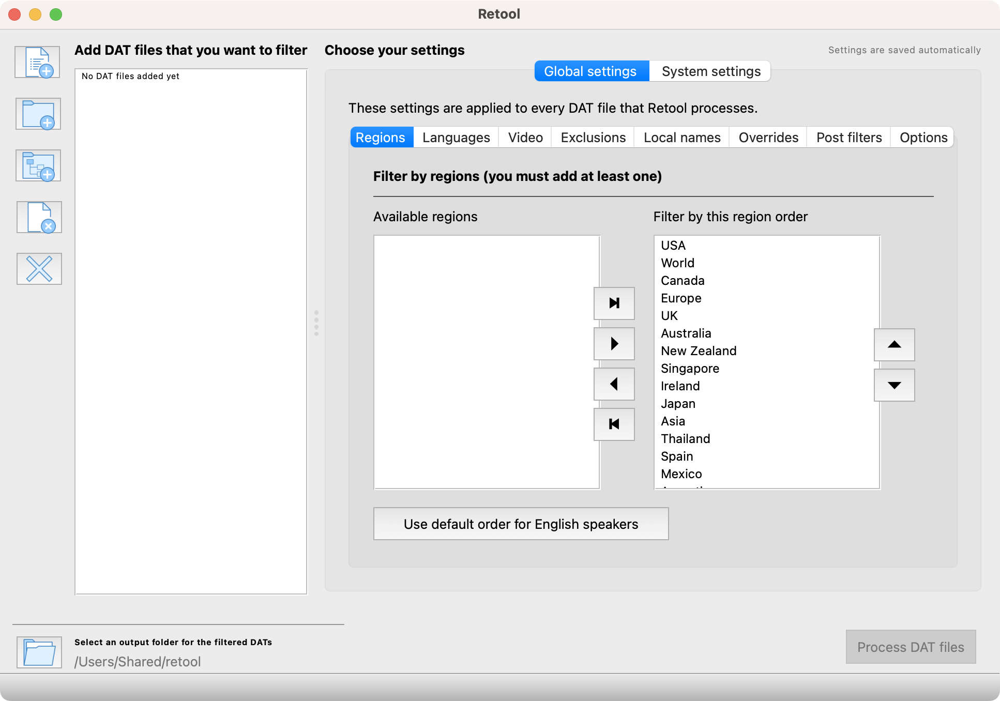
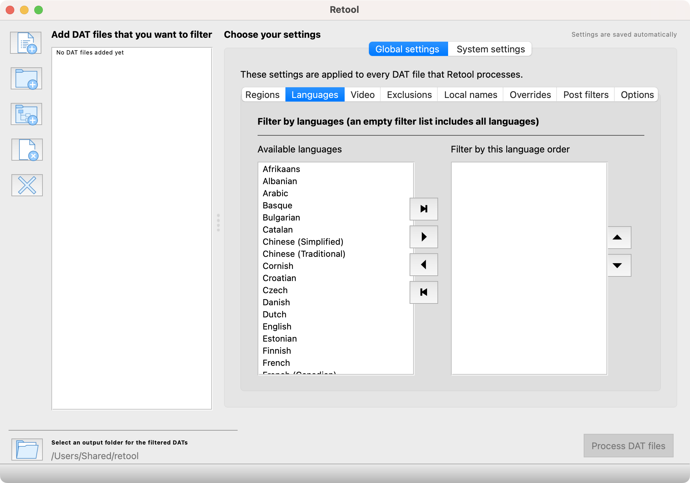
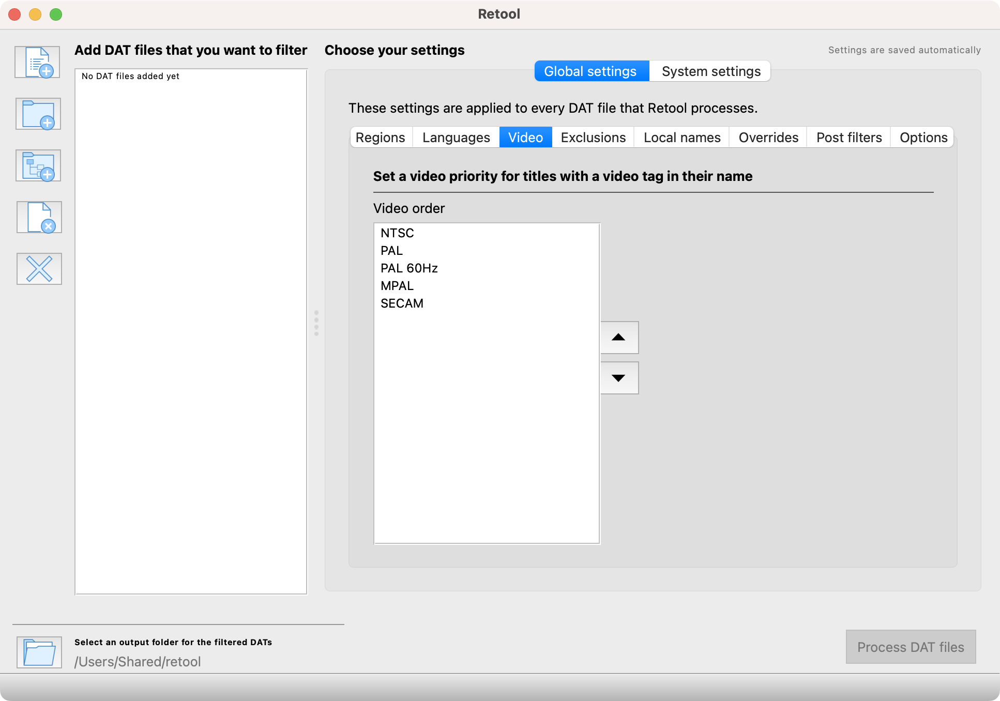
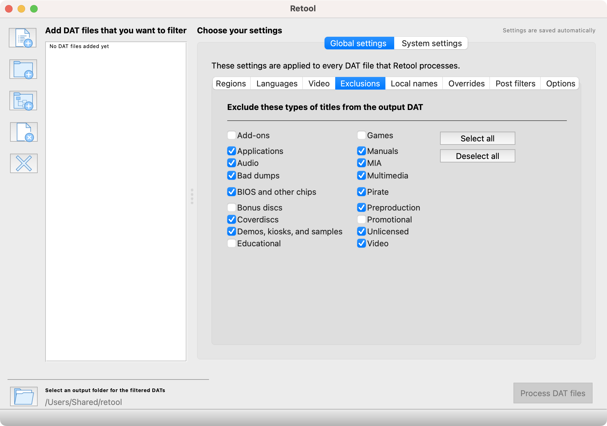
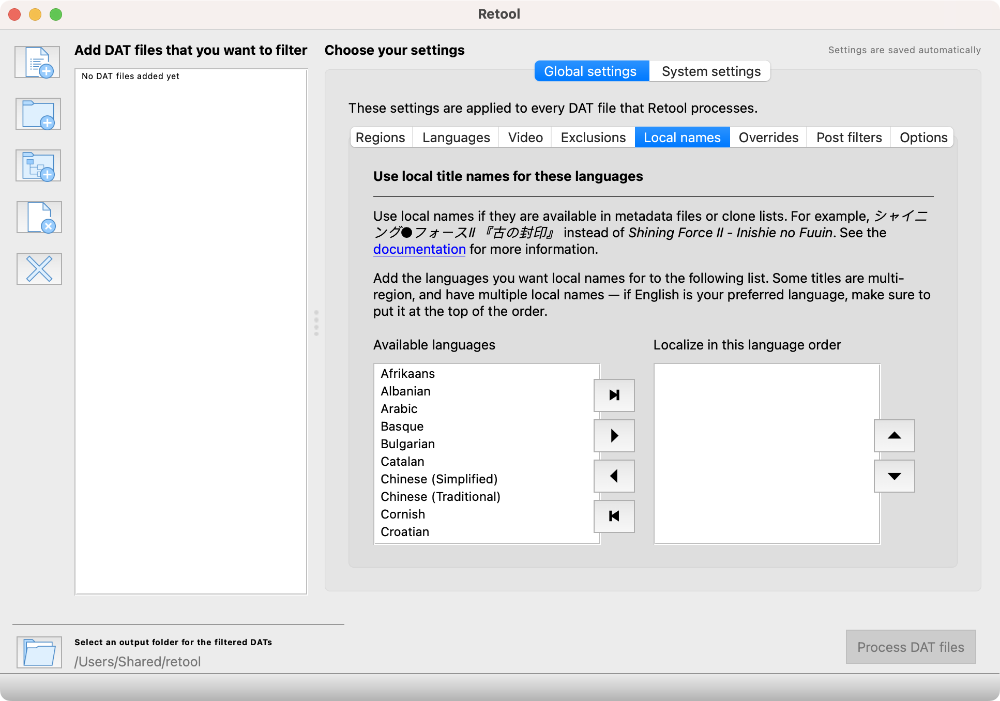
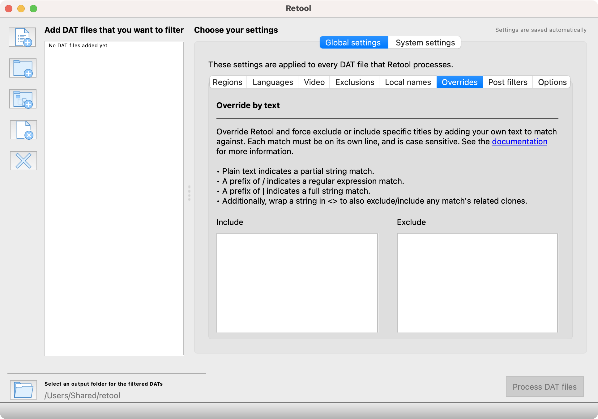
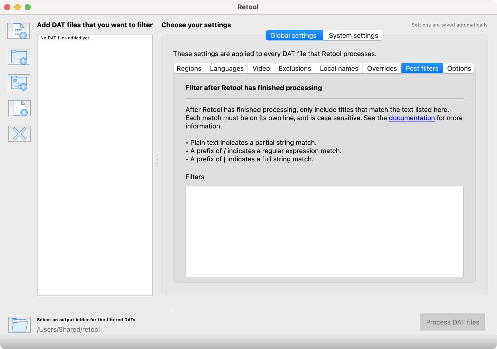
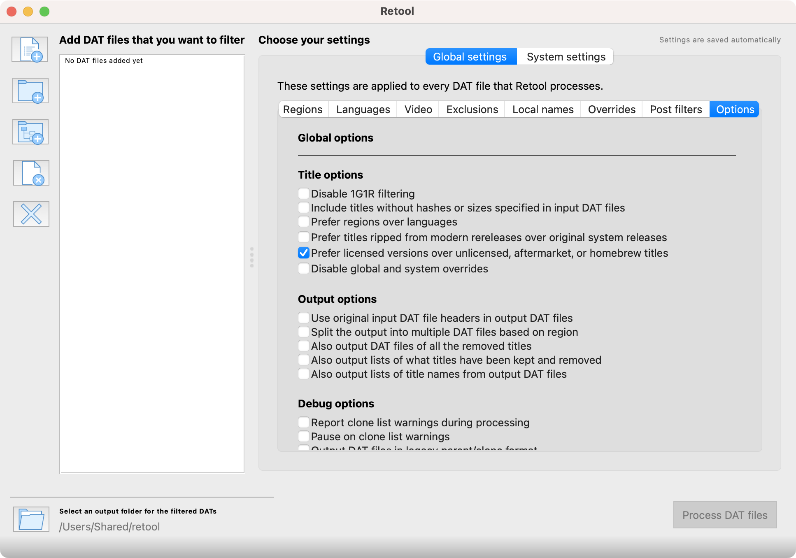

# [No-Intro] PropeR 1g1r Collection (2024)

🏛️ Internet Archive URL: https://archive.org/details/proper1g1r-collection

This repository documents the [Retool](https://unexpectedpanda.github.io/retool) setup used to create the collection, the known missing systems and games, and is also used to track [issues](https://github.com/proper1g1r/proper1g1r-collection/issues).

## Retool setup

[Retool v2.02.0](https://github.com/unexpectedpanda/retool/releases/tag/v2.02.0) was used with the following configuration file: [user-config.yaml](retool/user-config.yaml).

### Regions

The default filter list for English speakers was used.

1. USA
1. World
1. Canada
1. Europe
1. UK
1. Australia
1. New Zealand
1. Singapore
1. Ireland
1. Japan
1. Asia
1. Thailand
1. Spain
1. Mexico
1. Argentina
1. Latin America
1. Brazil
1. Portugal
1. France
1. Belgium
1. Netherlands
1. Germany
1. Austria
1. Italy
1. Switzerland
1. Hong Kong
1. China
1. Taiwan
1. Korea
1. Russia
1. Ukraine
1. Estonia
1. Poland
1. Latvia
1. Lithuania
1. Denmark
1. Norway
1. Sweden
1. Scandinavia
1. Finland
1. Iceland
1. Hungary
1. Czech
1. Greece
1. Macedonia
1. India
1. South Africa
1. Israel
1. Slovakia
1. Turkey
1. Croatia
1. Slovenia
1. United Arab Emirates
1. Bulgaria
1. Romania
1. Albania
1. Serbia
1. Indonesia
1. Unknown

📸

### Languages

The default empty filter list was used to include all languages.

📸

### Video

The default video order was used:

1. NTSC
1. PAL
1. PAL 60Hz
1. MPAL
1. SECAM

📸

### Exclusions

The following types were checked to be excluded:

- Applications
- Audio
- Bad dumps
- BIOS and other chips
- Coverdiscs
- Demos, kiosks, and samples
- Manuals
- MIA
- Multimedia
- Pirate
- Preproduction
- Unlicensed
- Video

The following types were unchecked to be included:

- Add-ons
- Bonus discs
- Educational
- Games
- Promotional

📸

### Local names

Local names were kept empty.

📸

### Overrides

Overrides were kept empty.

📸

### Post filters

Post filters were kept empty.

📸

### Options

The only option checked was "Prefer licensed versions over unlicensed, aftermarket, or homebrew titles" in the "Title options" section.

📸

## Missing systems and games

### Games not found

They're not present in [No-Intro ROM Sets (2024)](https://archive.org/details/ni-romsets) or [Myrient](https://myrient.erista.me/files/No-Intro) and weren't found anywhere else.

- Atari - 8-bit Family is missing [Centipede (Europe)](https://datomatic.no-intro.org/index.php?page=show_record&s=203&n=0009).
- Sega - Beena is missing [Taiko no Tatsujin Ongaku Lesson (Japan)](https://datomatic.no-intro.org/index.php?page=show_record&s=113&n=0058) and [Pururun! Shizuku-chan Asonde Tanoshiku Nouryoku Up (Japan)](https://datomatic.no-intro.org/index.php?page=show_record&s=113&n=0057).

### Systems not found

Same as the missing games, no ROMs matching the DAT file were found.

- LeapFrog - Explorer

### Systems with an empty DAT file from DAT-o-MATIC

The usual DAT generation options used (no bios, only full titles, etc) resulted in an empty DAT file.

- Atari - Jaguar (ABS)
- Atari - Jaguar (COF)
- Atari - Lynx (BLL)
- Atari - Lynx (LNX)
- VTech - Mobigo

### Systems with no DAT file generated by Retool

No game from these systems matched our Retool criteria.

- Arcade - PC-based
- Fukutake Publishing - StudyBox

### Systems too large

They may eventually be added to the collection.

- Nintendo - Nintendo DS (Encrypted)
- Nintendo - Nintendo DS (Decrypted)
- Nintendo - Nintendo 3DS
- Nintendo - New Nintendo 3DS

### Systems not part of the collection

They have no actual games.

- Nintendo - Game Boy Advance (Video)
- Nintendo - Kiosk Video Compact Flash
- Nintendo - Misc
- Nintendo - Wallpapers

### Systems flagged as malware by archive.org

Not sure why that happened as our ZIP file was merely a subset of another ZIP hosted on their website.

- Mobile - J2ME
